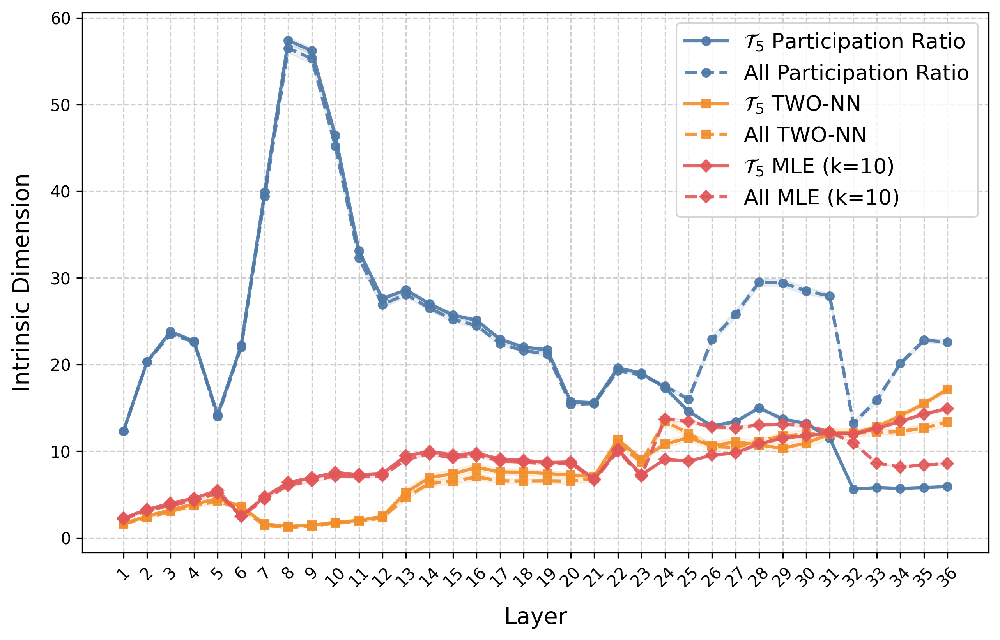
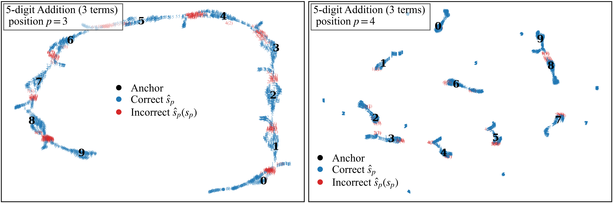
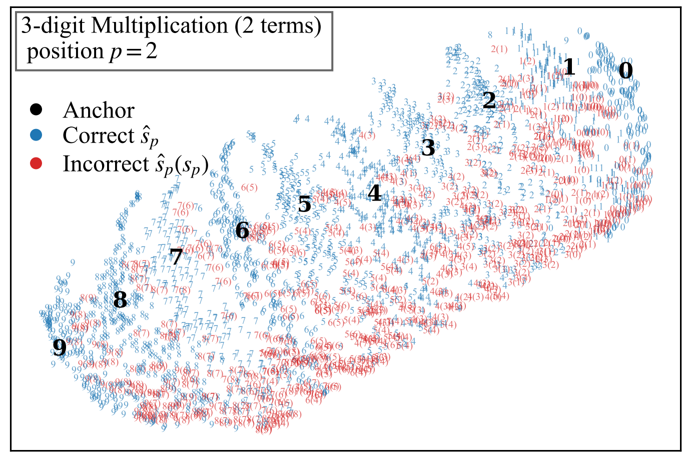
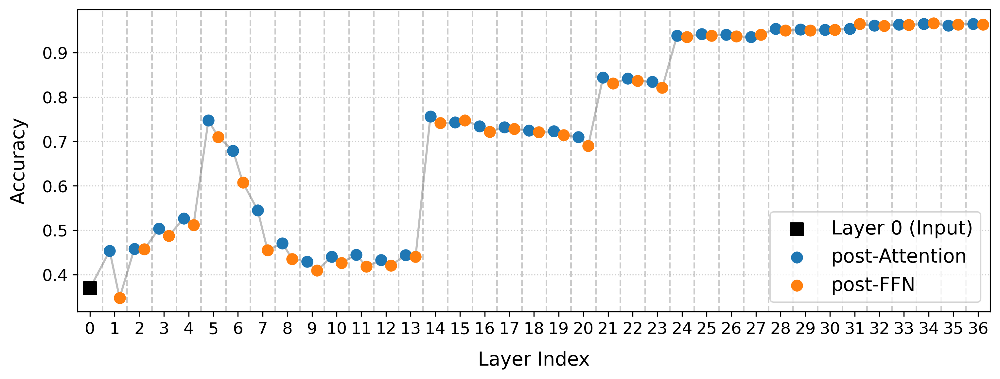

**Figure R1. Native-space intrinsic dimensionality across IRSTs.** Evaluated on Qwen3-4B ($p=4$) during the addition of three 10-digit integers. We report the Participation Ratio (linear effective dimension), TWO-NN, and Levina-Bickel MLE ($k=10$) for $\mathcal{T}_0 \dots \mathcal{T}_9$ and their union (All) in the 2560-D last layer residual stream, with error bars (obtained via 10 bootstrap iterations, with each trajectory downsampled to $500$ samples). Results show that trajectory-conditioned representations occupy stable low-dimensional subsets in native space. The pooled union (All) has a substantially larger linear effective dimension but a smaller local non-linear intrinsic dimension, indicating that linear and neighborhood-based estimators capture different geometric scales of the representation space.

**Figure R2. Layer-wise evolution of intrinsic dimensionality.** Evaluated across the residual stream layers (corroborating App. K). Settings remain the same as above. We compare a specific sub-manifold $\mathcal{T}_5$ against the global union of all trajectories (All). The two remain broadly similar up to around layer 23. Between layers 23–31, $\mathcal{T}_5$ shows slightly lower nonlinear ID than the pooled set under MLE, whereas after layer 31 its nonlinear ID becomes modestly higher. One possible interpretation is that a shared coarse-grained scaffold forms earlier, while finer trajectory-specific local structure becomes more pronounced in later layers. This qualitative trend is also broadly consistent with App. K.

**Figure R5. Impact of arithmetic complexity on manifold geometry.** UMAP projections during a simpler 3-operand, 5-digit addition task (Qwen3-4B). **Right ($p=4$)**: When carry propagation is minimal or highly skewed (lower complexity), representations collapse into tight, isolated digit basins. The continuous IRST connecting bridges are absent, and topological slippage (errors) is extremely rare. **Left ($p=3$)**: As active carry propagation introduces higher variance and complexity, the latent space expands to form the continuous IRSTs. This structural expansion creates boundary regions where "off-by-one" slippage errors (red markers) begin to systematically emerge.

**Figure R3. UMAP projection of representations during 3-digit × 3-digit multiplication.** Evaluated on Qwen3-4B at position $p=2$ in the last layer. A coarse digit-basin organization remains visible: representations are still arranged primarily by output digit identity, and most errors lie in transition regions between adjacent digit basins, with off-by-one confusions remaining dominant. At the same time, the finer fiber/trajectory structure is much less explicit than in addition, suggesting that any multiplication analogue of IRST may be more entangled and higher-dimensional, rather than a clean set of threads.

**Figure R3. Layer-wise Input Carry decoding accuracy for Attention vs. FFN outputs.** Evaluation settings remain as above. Probes were trained separately on the outputs of the Attention and FFN blocks at each layer. Attention modules exhibit stepwise jumps in accuracy (most notably at layers 5, 14, 21, and 24), indicating their primary role in routing and forming the carry signal. FFN representations largely follow these updates. The non-monotonic trajectory (e.g., the dip after layer 5) hints at a possible multi-phase computational mechanism.
